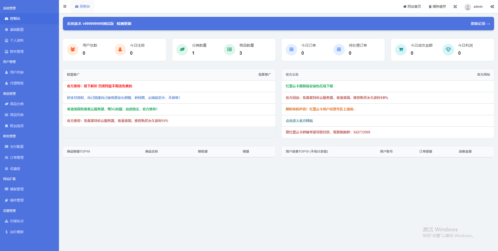
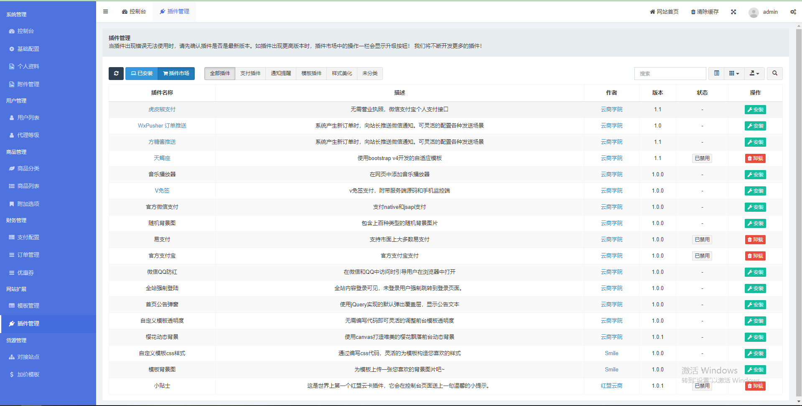
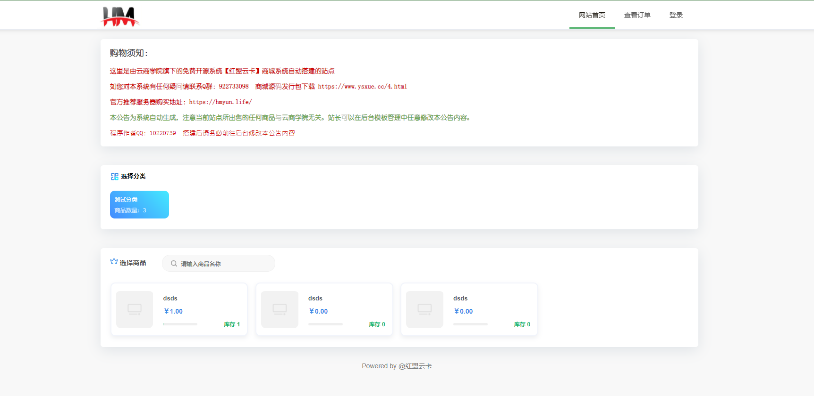
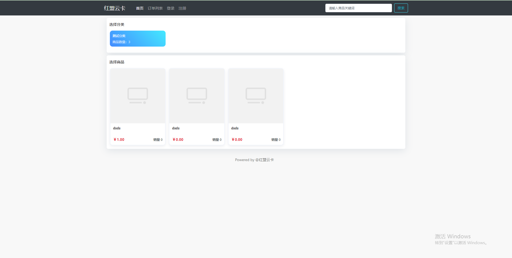

红盟云卡系统是【云商学院】旗下的一款基于PHP+MySQL开发的虚拟商品在线售卖平台

最新版安装包【官方】下载（免费下载）：http://download.yuns.life/hmyk-newest.zip

官方演示站①（默认模板）：http://yk.yuns.life/

官方演示站②（天蝎座模板）：http://tx.yuns.life/

官方演示站（后台）：http://yk.yuns.life/admin/

管理员帐号：admin 密码：123456

免备案服务器购买地址：https://hmyun.life/

## 简介

集成了常见的多种支付接口

支付宝官方PC/手机/当面付

微信官方Native/Jsapi/H5

易支付

码支付（目前市面上的码支付基本都兼容了易支付接口，通常直接配置到易支付上就能用）

虎皮椒支付

Stripe支付

V免签

USDT支付

拥有多种功能

在线更新：版本升级，无需繁琐操作，只需要在后台点击即可一键更新！

用户管理、代理等级

手动补单、投诉工单

邮件发信、查单密码

优惠券（支持全商品/指定分类/单品券生成）

对接功能 支持同系统/卡卡云/时空云等多个货源渠道

丰富的插件功能：自定义背景图/全站透明样式/防洪跳转页引导/美化动态背景/订单微信通知

## 问题反馈

在使用中有任何问题，请使用以下联系方式联系我们

红盟云卡反馈建议专区：https://www.ysxue.cc/hmyk/13.html

## 截图展示

## 版权信息

红盟云卡系统遵循Apache2开源协议发布，并提供免费使用。

本项目包含的第三方源码和二进制文件之版权信息另行标注。

版权所有Copyright © 2017-2020 by 云商学院 (https://www.ysxue.cc/)

All rights reserved。
